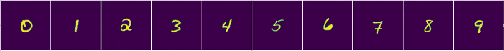
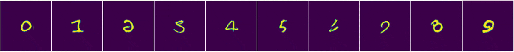

# 🦠 NCA Classifier

**Embodied classification with neural cellular automata**

Each notebook presents a self contained experiment.

## Results visualizations

**Region activation**

<table>
  <tr>
    <td>Good vs. Bad region classification</td>
    <td>
      
      
    </td>
  </tr>
  <tr>
    <td>Visualizing select hidden channels</td>
    <td></td>
  </tr>
</table>

**Canonical normalization**

<table>
  <tr>
    <td>Grid of normalization examples</td>
    <td>
       
      Top to bottom - best to worst
    </td>
  </tr>
</table>
